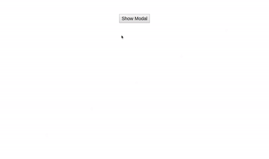

# ReactJS - MessageDialog component

ReactJS based MessageDialog component used for showing custom dialog with message. You can even change number of buttons on that. You can also hide header and cross icon.

## Table of contents

- [Browser Support](#browser-support)
- [Demo](#demo)
- [Getting started](#getting-started)
- [Usage](#usage)
- [Available Props](#available-props)
- [Methods](#methods)
- [Want to Contribute?](#want-to-contribute)
- [Collection of Other Components](#collection-of-components)
- [Changelog](#changelog)
- [License](#license)

## Browser Support

|  |  |  |  |  |
| ---------------------------------------------------------------------------------------- | ------------------------------------------------------------------------------------------- | ---------------------------------------------------------------------------------------- | ---------------------------------------------------------------------------------- | ---------------------------------------------------------------------------------------------------------------------------- |
| 83.0 ✔                                                                                   | 77.0 ✔                                                                                      | 13.1.1 ✔                                                                                 | 83.0 ✔                                                                             | 11.9 ✔                                                                                                                       |

## Demo

[](https://github.com/weblineindia/ReactJS-MessageDialog/modaldialog.gif)

## Getting started

```bash
npm install react-weblineindia-message-dialog-box
# or use npm
yarn add react-weblineindia-message-dialog-box
```

## Usage

```js
import React, { Component } from "react";
import MessageDialogBox from 'react-weblineindia-message-dialog-box'

class Test extends Component {
    constructor(props) {
    super(props);
    this.state = {
       visible:true,
       content:"Hello",
       showHeader:"Modal Title",
       buttons:[{
         id:1,
         title:"Yes"
       },
       {
         id:2,
         title:"No"
       },
       ]
    };
    onClose(value){
      this.setState({
        visible : value
      })
    }
    onButtonClick(event ,value){
        this.setState({
        visible : !value
      })
    }
    render(){
    return (
      <div>
        <MessageDialogBox
        content={this.state.content}
        visible={this.state.visible}
        buttons={this.props.buttons}
        onClose={this.onClose.bind(this)}
        onButtonClick={this.onButtonClick.bind(this)}
        />
      </div>
    )}
}
```

## Available Props

| Prop            | Data Type | Default | Description                                                                      |
| --------------- | --------- | ------- | -------------------------------------------------------------------------------- |
| `id`            | string    |         | id of the component                                                              |
| `name`          | string    |         | name of the component                                                            |
| `visible`       | Boolean   | false   | Show/Hide Modal.                                                                 |
| `content`       | String    |         | Content of the modal                                                             |
| `buttons`       | Array     | []      | Buttons objects to contain the button label, button click event, no buttons etc. |
| `showHeader`    | boolean   | false   | To hide or show the header of the component.                                     |
| `headerContent` | String    |         | header Content of the modal.                                                     |

## Methods

| Name            | Description                           | Value             |
| --------------- | ------------------------------------- | ----------------- |
| `onButtonClick` | Emitted when the button click         | event             |
| `close`         | Emitted when click on the close modal | event ,modalValue |

## Want to Contribute?

- Created something awesome, made this code better, added some functionality, or whatever (this is the hardest part).
- [Fork it](http://help.github.com/forking/).
- Create new branch to contribute your changes.
- Commit all your changes to your branch.
- Submit a [pull request](http://help.github.com/pull-requests/).

---

## Collection of Components

We have built many other components and free resources for software development in various programming languages. Kindly click here to view our [Free Resources for Software Development](https://www.weblineindia.com/communities.html).

---

## Changelog

Detailed changes for each release are documented in [CHANGELOG.md](./CHANGELOG.md).

## License

[MIT](LICENSE)

[mit]: https://github.com/weblineindia/ReactJS-MessageDialog/blob/master/LICENSE

## Keywords

react-weblineindia-message-dialog-box, message-dialog-box, react-message-dialog-box, reactjs-message-dialog-box, alertbox, messagedialog, message-dialogbox, react-alertbox
